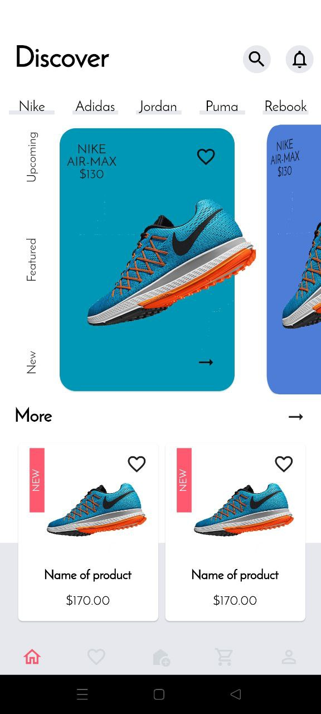

# Snikers Shop

## Description

_Sneakers shop_ app designed for shop system.
It gives the opportunity to watch the product list and product description,
and add to the bag. With various animations, the app becomes more interesting for users.

## Emphasis
_Used Dart version **2.18.2**_

_Used Flutter version **3.3.4**_

## Dependencies

```flutter_bloc: ^8.1.1```  [fluuter_bloc](https://pub.dev/packages/flutter_bloc/install).

```bloc: ^8.1.0``` [bloc](https://pub.dev/packages/bloc/install).

## Setup 
 ``` git clone repository or download ```

 ``` flutter create .```

 ``` flutter pub get ```

 ``` run on emulator or real device ```

## Links

For installing Flutter wisit  [flutter.dev](https://flutter.dev/).

## Images
<p float="center">
  
   
  
</p>

## Project structure

```
sneakers_shop
├─ .gitignore
├─ .metadata
├─ analysis_options.yaml
├─ assets
│  ├─ data
│  │  └─ data.json
│  ├─ fonts
│  │  ├─ JosefinSans-Italic.ttf
│  │  └─ JosefinSans-Regular.ttf
│  └─ images
│     ├─ sneaker_01.png
│     ├─ sneaker_02.png
│     ├─ sneaker_03.png
│     └─ sneaker_04.png
├─ lib
│  ├─ core
│  │  ├─ constants
│  │  │  ├─ app_colors.dart
│  │  │  ├─ app_values.dart
│  │  │  └─ texts.dart
│  │  ├─ error
│  │  │  ├─ exeptions.dart
│  │  │  └─ failures.dart
│  │  └─ usecases
│  │     └─ usecases.dart
│  ├─ features
│  │  └─ e_shop
│  │     └─ presentation
│  │        ├─ bloc
│  │        │  ├─ navbar_cubit.dart
│  │        │  └─ navbar_state.dart
│  │        ├─ pages
│  │        │  ├─ home_page
│  │        │  │  ├─ home_page.dart
│  │        │  │  └─ widgets
│  │        │  │     ├─ animated_slider.dart
│  │        │  │     ├─ animated_slider_card.dart
│  │        │  │     ├─ bottom_nav_menu.dart
│  │        │  │     ├─ filter_by_condition.dart
│  │        │  │     ├─ more_products.dart
│  │        │  │     ├─ product_card.dart
│  │        │  │     ├─ product_categories.dart
│  │        │  │     └─ product_categories_item.dart
│  │        │  ├─ my_bag_page
│  │        │  │  ├─ my_bag_page.dart
│  │        │  │  └─ widgets
│  │        │  │     └─ my_bag_item.dart
│  │        │  ├─ product_page
│  │        │  │  ├─ product_page.dart
│  │        │  │  └─ widgets
│  │        │  │     ├─ product_carousel.dart
│  │        │  │     └─ product_description.dart
│  │        │  └─ root_page
│  │        │     └─ root_page.dart
│  │        └─ widgets
│  │           ├─ custom_bottom_nav_bar.dart
│  │           ├─ custom_button.dart
│  │           ├─ custom_scaffold.dart
│  │           └─ custom_text.dart
│  └─ main.dart
```

## ToDo
* Add data and domain layers
* Add all screens and functions 
